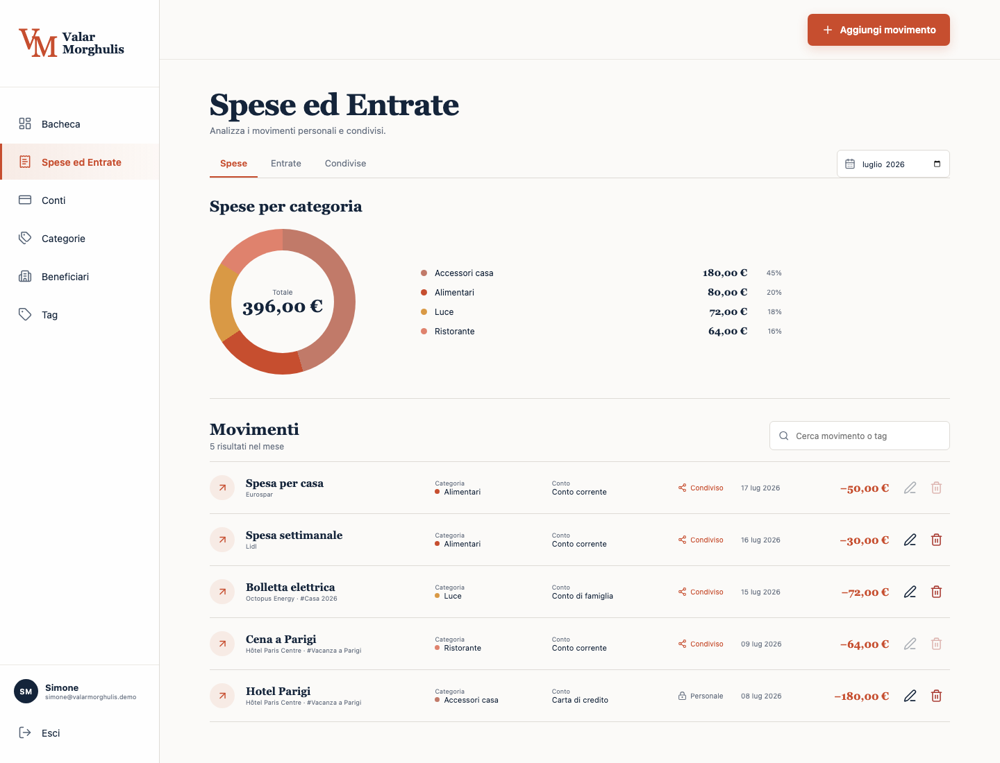

# Valar Morghulis


Web app mobile-first per gestire entrate e spese personali e familiari, conti, categorie, beneficiari, mittenti e tag. I movimenti condivisi vengono ripartiti in parti uguali tra tutti i membri della famiglia e il saldo si aggiorna automaticamente.



**App online:** [www.valarmorghulis.it](https://www.valarmorghulis.it/)

## Funzioni della prima versione

- iscrizione e accesso tramite email e password;
- entrate e spese personali private, oppure condivise con la famiglia;
- grafici mensili per categoria su spese, entrate e movimenti condivisi;
- grafico giornaliero della bacheca calcolato sulle spese condivise del mese corrente;
- confronto mensile in bacheca degli importi anticipati da ciascun membro per le spese condivise, escludendo i pagamenti effettuati direttamente da un conto condiviso;
- saldo automatico proporzionale al numero di membri e conti condivisi esclusi dal debito/credito;
- movimenti, rimborsi e operazioni familiari sincronizzati in tempo reale tra tutti i membri, mantenendo privati i dati personali;
- saldo iniziale dei conti modificabile con data di riferimento;
- movimenti antecedenti al saldo iniziale mantenibili solo nelle statistiche;
- rimborsi sottoposti alla conferma della controparte: soltanto dopo l’accettazione aggiornano saldo familiare e conti; il conto personale mancante può essere completato da chi lo possiede;
- condivisione facoltativa, per ogni famiglia, del solo nome dei conti personali utilizzabili nei rimborsi; saldo, istituto e movimenti restano privati;
- destinazione del rimborso selezionabile anche su un conto condiviso; in questo caso compensa soltanto la quota appartenente agli altri membri;
- conti personali e condivisi, contanti e giro fondi tra conti; un prelievo dal conto condiviso verso un conto personale genera un debito proporzionale alle quote degli altri membri;
- PayPal come conto personale;
- categorie, beneficiari e mittenti ricercabili mentre si scrive e creati automaticamente quando il nome non esiste; tag creabili durante l'uso;
- beneficiari per le spese e mittenti per le entrate, gestiti in due schede della stessa pagina e selezionabili anche durante la modifica dei movimenti storici;
- nomi di categorie, beneficiari e mittenti modificabili, con aggiornamento automatico dei movimenti già registrati, e commenti facoltativi sui movimenti;
- beneficiari e mittenti eliminabili scegliendo se riassegnare movimenti e rate a un'altra anagrafica oppure raggrupparli come “Nessun beneficiario” o “Nessun mittente”;
- suddivisione facoltativa di uno scontrino in più categorie, con parziali personali o condivisi indipendenti e residuo automatico sulla categoria principale;
- movimenti modificabili ed eliminabili dal loro autore direttamente dal pannello di modifica, con possibilità di cambiare la condivisione e ricalcolo immediato di conti, statistiche e saldo condiviso;
- eliminazione della prima rata estesa all’intero piano collegato e propagazione delle modifiche anagrafiche alle rate future;
- creazione del beneficiario direttamente dal modulo del movimento, con validazione del nome;
- bilancio e grafico delle spese per ogni tag;
- righe di riepilogo della pagina Tag configurabili senza nascondere i tag dai movimenti;
- spese in 3 o 5 rate con prima rata immediata e pagamenti successivi programmati;
- saldo familiare calcolato subito sull'intero acquisto condiviso, senza duplicarlo nelle rate future;
- modifica consentita solo all'autore del movimento;
- creazione della famiglia, conto condiviso facoltativo e inviti email ai membri;
- scelta esplicita tra accettazione e rifiuto dell’invito; nelle impostazioni gli amministratori vedono membri, inviti in attesa o scaduti da reinviare e inviti rifiutati da rimuovere;
- gestione account dal profilo nella barra laterale, con modifica di nome, cognome, email e password;
- appartenenza a più famiglie, selezione della famiglia attiva e ruoli amministratore/membro indipendenti per ciascuna;
- archivio personale unico fra tutte le famiglie e selettore della vista condivisa direttamente in bacheca;
- possibilità di iniziare senza creare una famiglia e aggiungerla in seguito dalle impostazioni;
- esportazione completa in JSON, CSV o XML prima della cancellazione definitiva dell’account;
- cancellazione amministrativa della famiglia, eliminando i dati condivisi oppure conservando come personali i movimenti creati da ciascun membro;
- creazione di ulteriori famiglie; l’autore ne diventa amministratore e può rinominarle e invitare membri;
- interfaccia italiana, euro e date italiane, ottimizzata per smartphone.
- guida integrata raggiungibile dal menù laterale, con introduzione, indice
  navigabile e capitoli su movimenti, condivisione, conti, anagrafiche, rate,
  rimborsi e gestione della famiglia;
- campi mobile ottimizzati per la tastiera virtuale senza zoom automatico invasivo.
- favicon, icona iOS e manifest per salvare la web app nella schermata Home.

## Configurare iscrizione e famiglie

L’ambiente di produzione utilizza Supabase per autenticazione, famiglie, inviti
e conti condivisi. Per configurare un nuovo ambiente:

1. crea un progetto Supabase;
2. collega il repository e applica la migration in
   `supabase/migrations/20260722193000_family_onboarding.sql` e
   `supabase/migrations/20260723183000_account_opening_balance_date.sql` e
   `supabase/migrations/20260724130000_multi_family_accounts.sql`,
   `supabase/migrations/20260725123000_private_family_app_data.sql` e
   `supabase/migrations/20260726110000_family_shared_records.sql` e
   `supabase/migrations/20260727100000_personal_workspace_and_deletion.sql` e
   `supabase/migrations/20260727150000_invitation_lifecycle.sql` e
   `supabase/migrations/20260727170000_movement_senders.sql` e
   `supabase/migrations/20260727233000_private_reimbursement_accounts.sql`;
3. pubblica la funzione `invite-family-member`;
4. configura il segreto della funzione con
   `APP_URL=https://www.valarmorghulis.it`;
5. copia `.env.example` in `.env.local` e inserisci URL e chiave pubblica del
   progetto;
6. aggiungi l'URL Cloudflare e `http://127.0.0.1:5173` agli URL di redirect
   consentiti in Supabase Auth.

Con Supabase CLI già configurata, i passaggi centrali sono:

```bash
supabase link --project-ref ID_PROGETTO
supabase db push
supabase functions deploy invite-family-member
supabase secrets set APP_URL=https://www.valarmorghulis.it
```

La chiave `service_role` rimane esclusivamente nella funzione Supabase e non deve
mai essere inserita in file `VITE_*` o commessa nella repository.

## Avvio locale

```bash
pnpm install
pnpm dev
```

## Deploy su Cloudflare

L'app è configurata come SPA statica su Cloudflare Pages. Dopo aver effettuato
l'accesso a Cloudflare con Wrangler, assicurati che
`.env.production.local` contenga `VITE_SUPABASE_URL` e
`VITE_SUPABASE_ANON_KEY`, quindi:

```bash
pnpm cloudflare:check
pnpm cloudflare:deploy
```

`cloudflare:check` interrompe il rilascio se la build non contiene la
configurazione Supabase, evitando di pubblicare accidentalmente la modalità
locale al posto dell'accesso email/password.

Produzione: [www.valarmorghulis.it](https://www.valarmorghulis.it/). Il dominio
usa un CNAME esterno verso `valar-morghulis-web.pages.dev`, mantenendo DNS ed
email presso Tophost.

Il backend gestisce account, appartenenze multiple, ruoli per famiglia, inviti e
conti condivisi. La famiglia attiva, oppure la vista solo personale, viene
ricordata localmente per ogni utente. Conti e movimenti personali vengono
salvati in uno snapshot privato Supabase unico per utente, così restano
invariati passando da una famiglia all’altra. Movimenti condivisi, rimborsi, operazioni sui
conti familiari e relative anagrafiche sono invece conservati come record
familiari normalizzati e aggiornati in tempo reale. Entrambi i livelli sono
protetti da RLS. Il browser conserva una copia locale come cache.

Controlli prima di pubblicare:

```bash
pnpm test
pnpm lint
pnpm run build
```

Per lo stato tecnico, le decisioni di prodotto e i prossimi passi consulta [HANDOFF.md](HANDOFF.md).

## Nota tecnica

Questa versione è un MVP con onboarding e persistenza cloud attivi. Lo snapshot
privato evita la perdita dei dati personali, mentre i record familiari
normalizzati mantengono allineati in tempo reale saldi e movimenti condivisi tra
tutti i membri.
