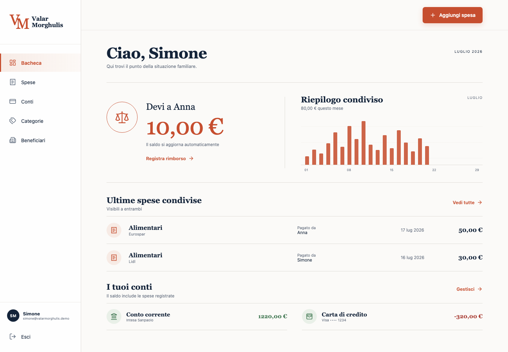

# Valar Morghulis

Web app mobile-first per gestire spese personali e familiari, conti, categorie e beneficiari. Le spese condivise vengono divise al 50% e il saldo tra i membri si aggiorna automaticamente.



**Demo online:** [siriusmac.github.io/valar-morghulis](https://siriusmac.github.io/valar-morghulis/)

## Funzioni della prima versione

- accesso demo come Simone o Anna;
- spese personali private e spese condivise visibili alla famiglia;
- saldo automatico 50/50 e registrazione rimborsi;
- gestione di conti, categorie e beneficiari;
- modifica consentita solo all'autore della spesa;
- dati demo salvati nel browser;
- interfaccia italiana, euro e date italiane, ottimizzata per smartphone.

## Avvio locale

```bash
pnpm install
pnpm dev
```

## Nota tecnica

Questa versione è un MVP locale. Per la commercializzazione saranno necessari un backend con autenticazione reale, database, gestione dei nuclei familiari, autorizzazioni server-side e conformità privacy.
