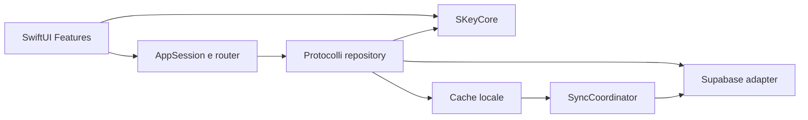

# Architettura nativa

## Struttura

L'app SwiftUI multipiattaforma vive attualmente in `apple/SKey`. La separazione
in un package locale `SKeyCore` rimane l'obiettivo quando verranno portati i
calcoli contabili completi: la UI dipenderà dal core, mentre il core non dovrà
importare SwiftUI né Supabase.

```text
SKey/
├── App/                 # entry point, sessione, router, configurazione
├── Features/            # auth, dashboard, movimenti, conti, directory, impostazioni
├── DesignSystem/
├── Infrastructure/      # Supabase, cache, sync, export
├── Packages/SKeyCore/   # dominio e calcoli puri
└── Tests/
```



## Stato e navigazione

- `@Observable @MainActor AppSession` conserva sessione, profilo, famiglie, famiglia attiva e stato sync.
- Servizi globali tramite `@Environment`; dipendenze locali tramite initializer.
- `TabView` per destinazioni principali; ogni tab mantiene il proprio `NavigationStack`.
- iPhone: tab bar e stack. iPad/Mac: sidebar adattiva e dettaglio.
- Modali tipizzati con enum `AppSheet`, non molte variabili booleane.
- Le route contengono ID leggeri, non modelli completi.

## Livelli

### SKeyCore

Tipi di dominio, validazioni, allocazione parziali, rate, saldi e aggregazioni. Testabile senza rete, database o UI.

### Repository

Protocolli suggeriti: `AuthRepository`, `ProfileRepository`, `FamilyRepository`, `LedgerRepository`, `DirectoryRepository`, `AccountRepository`, `ExportRepository`.

Ogni mutazione restituisce il record autorevole o un errore tipizzato. La UI può mostrare “salvato” solo dopo registrazione almeno nella coda persistente.

### Sincronizzazione

`SyncCoordinator` serializza le mutazioni per utente/famiglia, mantiene una coda persistente, usa retry con backoff e ricarica il server dopo conflitti o approvazioni. Realtime accelera l'aggiornamento ma non sostituisce refresh in foreground e pull-to-refresh.

## Errori e preview

Definire errori applicativi stabili (`authenticationRequired`, `permissionDenied`, `conflict`, `offline`, `validation`, `server`) e mapparli a messaggi italiani. Ogni schermata principale ha preview deterministiche per caricato, vuoto, caricamento ed errore usando repository finti, mai rete reale.
